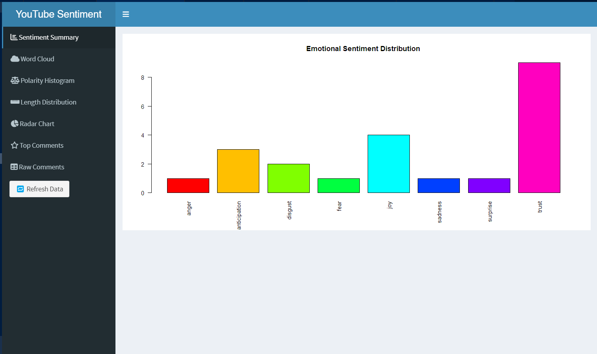

# YouTube Comments Sentiment Analyzer 🎥📊

A tool to fetch comments from a YouTube channel's latest videos and analyze their sentiment using Python and R Shiny. Perfect for content creators or researchers to gauge audience reactions!

 [](LICENSE)

## Features ✨
- **Comment Extraction**: Fetches comments from a channel's 5 most recent videos.
- **Sentiment Analysis**: Visualizes emotional sentiment (anger, joy, sadness, etc.) using NRC lexicon.
- **Word Cloud**: Generates a word cloud from cleaned comment text.
- **One-Click Workflow**: Bash script automates the entire process.

---

## Prerequisites 📋
- **Python 3.8+** with `pip`
- **R 4.0+** with packages: `shiny`, `tidytext`, `ggplot2`, `wordcloud`, `readr`, `syuzhet`, `stopwords`
- Terminal access (VS Code integrated terminal)

---

## Installation 🛠️

### 1. Clone the Repository
```bash
git clone https://github.com/Gaurav0963/YouTube-comments-sentiment-analysis.git
cd YouTube-comments-sentiment-analysis  # Change to project directrory
```

### 2. Install Python Dependencies
```bash
conda create -n venv python==3.9 -y
conda activate venv

pip install -r requirements.txt
```

### 3. Install R Packages
Run in R console:
```r
install.packages(c(
  "shiny", "shinydashboard", "ggplot2", "dplyr", "tidytext",
  "readr", "wordcloud", "syuzhet", "stopwords", "fmsb"
))
```
💡 Make sure R is available in your system PATH. You can test this by running: `R --version`

## Usage 🚀

Step 1: Fetch Comments & Launch Shiny 
```bash
# Run the analysis (default channel: Veritasium)
./run_youtube_analysis.sh
```
Step 2: Interact with the `Shiny` 

A browser window will open with three tabs:

- Sentiment Plot: Bar chart of emotion distribution.

- Word Cloud: Most frequent words in comments.

- Raw Comments: Top 20 comments.

Click "🔁 Refresh Data" after updating `comments.csv`.

### Analyze a Different Channel
Edit `run_youtube_analysis.sh` and replace the default URL:
```
CHANNEL_URL="https://www.youtube.com/@YourChannelName"
```

---

## Project Structure 📂
```
youtube-comments-analyzer/
├── fetch.py              # Fetches video URLs and comments using yt-dlp
├── requirements.txt      # Python dependencies
├── run_youtube_analysis.sh  # Automated workflow script
├── shiny_app/
│   └── app.R             # R Shiny dashboard for visualization
└── comments.csv          # Generated after running the script (not in initial repo)
```
---
## Troubleshooting ⚠️
#### "comments.csv not found"
- Ensure the channel URL is correct and public.

- Check Python virtual environment activation.

#### Shiny App Fails to Launch
 * Verify R packages are installed.

 * Run manually in R: `shiny::runApp('shiny_app')`

#### No Comments Retrieved
- YouTube may limit comment scraping. Test with a highly active channel.

## Customization 🎨
#### Change Number of Comments/Videos
Edit `fetch.py`:

- `max_results=5` in `get_latest_videos()`

- `max_comments=10` in `save_comments_to_csv()`

#### Modify Sentiment Analysis
Edit `shiny_app/app.R`:

- Adjust `get_nrc_sentiment()` parameters

- Change word cloud colors or max words

## Acknowledgments 🙏
Built with `yt-dlp` and `R Shiny`

NRC Emotion Lexicon: Saif M. Mohammad

## License 📄
[MIT License.](/LICENSE)